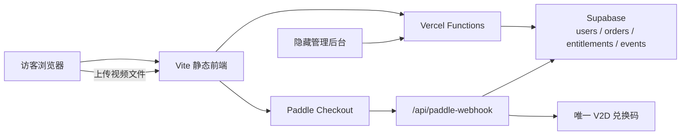

# vid2ppt.com 技术架构文档

最后更新：2026-07-31

维护范围：`vid2ppt.com` 前端、上传视频抽帧、PPT/PDF 生成、账号、Paddle 支付、赞助订单、兑换码、权益与管理后台。

维护规则：凡涉及支付、账号、权限、视频输入方式、数据表、环境变量或部署链路的改动，必须在同一个 PR 或提交中同步更新本文件。文档只记录 secret 名称，不记录值。

## 1. 系统边界

1. `vid2ppt.com` 独立处理自己的账号、Paddle checkout、支付回调、订单和兑换码。
2. 本站保留私有配置驱动的可选外部权益赠送适配器；默认关闭，只有验签后的支付事件、合法配置和匹配套餐同时成立时才调用外部接口。
3. 当前公开赞助入口使用首页简单金额弹窗；Webhook 仍把支付写入本站订单与审计表。
4. 历史订单中已有的来源或权益字段只作为审计记录保留，不用于触发新的跨站请求。
5. 视频输入只开放用户本地上传；在线视频 URL 下载、URL 元数据解析、YouTube fallback 和屏幕录制入口由 feature flag 默认关闭。
6. 管理后台入口只在有效超级管理员会话中显示，数据接口仍执行服务端鉴权。

## 2. 总览

## 3. 关键目录

| 路径 | 用途 |
| --- | --- |
| `src/main.ts` | 主产品 UI、上传视频抽帧、工作台与导出。 |
| `src/style.css` | 主产品样式。 |
| `public/sponsor/index.html` | 兼容旧分享链接，跳转到 `/?sponsor=1` 并自动打开首页赞助弹窗。 |
| `public/admin/index.html` | 超级管理员原始数据后台。 |
| `api/auth.py` / `api/_auth.py` | 注册、登录与 session。 |
| `api/usage.py` | 用量、行为事件、赞助意图、兑换码查询和管理数据。 |
| `api/paddle-config.py` | Paddle 前端公开配置。 |
| `api/paddle-webhook.py` | Paddle 验签、支付落库和兑换码生成。 |
| `api/download-video.py` | URL 下载实现；默认关闭时 GET/POST 返回 410。 |
| `api/youtube-fallback.ts` | YouTube fallback；默认关闭时 GET/POST 返回 410。 |
| `api/media/metadata.py` | URL 元数据解析；默认关闭时 GET/POST 返回 410。 |
| `supabase/schema.sql` | 账号、权益、行为和赞助订单 schema。 |
| `vercel.json` | Vercel rewrite 与函数运行配置。 |

## 4. 视频处理

### 4.1 当前入口

- 首页和工作台只展示视频文件上传入口。
- 支持单文件处理、批量抽帧、去重、补抓、裁剪，以及导出 PDF、PPTX 和 Frames ZIP。
- `VITE_URL_IMPORT_ENABLED`、`VITE_SCREEN_RECORDING_ENABLED` 默认未设置时，URL 表单和屏幕录制控件作为隐藏兼容节点保留，原事件与处理结构不删除。
- 服务端 `VID2PPT_URL_IMPORT_ENABLED` 默认未设置，即为关闭；旧浏览器缓存或手工请求调用三个 URL 接口时统一返回 HTTP 410。
- 日后恢复 URL 功能时，需要同时打开前端构建开关和服务端环境变量，再完成受控验证。

### 4.2 发布验证

- 首页不能显示在线视频链接输入框或录屏按钮。
- 上传一个本地视频后可以进入工作台并开始抽帧。
- `/api/download-video`、`/api/youtube-fallback`、`/api/media/metadata` 的 GET/POST 都必须返回 410。

## 5. 账号与管理员

- `site_users` 保存用户名、规范化邮箱、密码 hash、来源和登录时间。
- 密码使用 PBKDF2-SHA256；session 使用 `AUTH_SECRET` 签名。
- `SITE_ORIGIN` 生产值为 `vid2ppt`。
- 管理员用户名由 `VID2PPT_ADMIN_USERNAME` 配置，密码由 `VID2PPT_ADMIN_PASSWORD` 配置。
- 前端隐藏管理员入口只是显示规则；`/api/usage?action=admin_data` 必须校验 admin token。

## 6. 赞助与 Paddle

1. 首页导航和产品区按钮打开同一个简单赞助弹窗。
2. 弹窗提供 `¥10 / ¥20 / ¥50 / ¥80 / ¥100 / ¥200` 与自定义金额，不要求先输入邮箱。
3. `/sponsor/` 保留为可分享入口，但只负责跳转到 `/?sponsor=1` 自动打开该弹窗。
4. 页面通过 `PADDLE_PRICE_AUTHOR_TIP_CNY_CENT` 打开 overlay checkout；自定义金额最低输入 ¥1，实际 checkout 最低 ¥10。
5. `/api/paddle-webhook` 使用 `PADDLE_WEBHOOK_SECRET` 验证原始请求，并把支付保存为本站 `author_tip` 订单及审计事件。
6. 兑换码、按邮箱查询和单笔订单查询结构继续保留在服务端和 Git 历史中，但当前公开赞助界面不展示。
7. `VID2PPT_EXTERNAL_LINK_ENABLED` 默认未配置，即为关闭；启用后 Webhook 从私有配置解析目标、套餐映射和元数据字段，并以 HMAC-SHA256 调用外部权益接口。

Paddle 是支付事实来源。客户端 checkout 成功事件只用于即时提示，支付落库以验签后的 Webhook 为准。

## 7. 赞助金额

| 入口 | 金额 | 结果 |
| --- | --- | --- |
| 固定金额 | ¥10 / ¥20 / ¥50 / ¥80 / ¥100 / ¥200 | 直接打开 Paddle overlay checkout |
| 自定义金额 | 输入 ¥1 起，checkout 最低 ¥10 | 打开同一 Paddle overlay checkout |

公开界面不展示私有套餐映射、外部权益目标或内部兑换规则。

## 8. API 清单

| Endpoint | 方法 | 状态 / 用途 |
| --- | --- | --- |
| `/api/captcha` | GET | 登录/注册验证码。 |
| `/api/auth` | GET/POST | session、登录、注册。 |
| `/api/entitlement` | GET | 本站当前权益。 |
| `/api/usage` | GET/POST | 用量、订单、代码、事件和管理数据。 |
| `/api/paddle-config` | GET | Paddle 前端公开配置。 |
| `/api/paddle-webhook` | POST | Paddle 签名 webhook。 |
| `/api/download-video` | GET/POST | URL 下载；flag 默认关闭并返回 410。 |
| `/api/youtube-fallback` | GET/POST | YouTube fallback；flag 默认关闭并返回 410。 |
| `/api/media/metadata` | GET/POST | URL 元数据；flag 默认关闭并返回 410。 |
| `/api/summarize` / `/api/summarize-simple` | POST | 摘要与相关用量。 |

## 9. 数据与审计

| 表 | 用途 |
| --- | --- |
| `site_users` | 本站用户身份。 |
| `user_entitlements` | 本站权益。 |
| `usage_events` | 产品行为与支付事件。 |
| `sponsor_orders` | checkout、支付、兑换码和审计元数据。 |

- `sponsor_orders.request_id` 和 `sponsor_orders.code` 唯一。
- 邮箱先规范化为小写；按邮箱历史查询不合并重复购买。
- 历史行可以保留已经写入的旧字段，禁止批量改写支付事实。
- 新订单只有在外部权益开关开启、私有配置有效且套餐匹配时才产生外部赠送调用。

## 10. Secrets

| 名称 | 用途 |
| --- | --- |
| `SUPABASE_URL` | Supabase 项目地址。 |
| `SUPABASE_SERVICE_ROLE_KEY` | 服务端数据库访问。 |
| `AUTH_SECRET` | session 与验证码签名。 |
| `VID2PPT_ADMIN_USERNAME` | 超级管理员用户名。 |
| `VID2PPT_ADMIN_PASSWORD` | 超级管理员密码。 |
| `PADDLE_ENV` | Paddle 环境。 |
| `PADDLE_CLIENT_TOKEN` | Paddle.js 客户端 token。 |
| `PADDLE_WEBHOOK_SECRET` | Webhook 验签。 |
| `PADDLE_PRICE_AUTHOR_TIP_CNY_CENT` | CNY 分单位共享价格。 |
| `SPONSOR_CODE_SECRET` | 兑换码 HMAC。 |
| `VITE_URL_IMPORT_ENABLED` | 前端 URL 输入开关；默认关闭。 |
| `VITE_SCREEN_RECORDING_ENABLED` | 前端录屏入口开关；默认关闭。 |
| `VID2PPT_URL_IMPORT_ENABLED` | URL 服务端总开关；默认关闭。 |
| `VID2PPT_EXTERNAL_LINK_ENABLED` | 可选外部权益赠送总开关；默认关闭。 |
| `VID2PPT_EXTERNAL_GRANT_CONFIG_B64` | 私有 Base64 JSON 配置，保存目标 URL、套餐映射、权益字段和请求元数据。 |
| `VID2PPT_EXTERNAL_GRANT_SECRET` | 外部赠送请求的 HMAC-SHA256 共享密钥。 |
| `VID2PPT_OWNER_USERNAMES` | 私有 owner 用户名列表。 |
| `SITE_ORIGIN` | 生产应为 `vid2ppt`。 |

外部赠送配置只保存在 Vercel 加密环境变量中，不进入 Git、构建日志或产物；开关关闭时不解析目标配置，也不发起请求。

## 11. 发布约束

1. 不得从客户端支付完成事件直接生成代码。
2. 只有 Paddle Webhook 验签成功、私有配置有效且套餐匹配时，赞助支付流程才可调用外部权益适配器。
3. 不得重新展示 URL 下载或录屏入口；恢复任何输入方式必须同时更新前端、后端和本文档。
4. 不得只靠隐藏按钮保护管理后台。
5. 不得重写历史支付记录；新旧行为通过时间和字段区分。
6. 发布前运行 TypeScript 构建和 Python tests；发布后检查主页赞助弹窗、`/sponsor/` 自动打开、上传抽帧与三个 410 接口。
